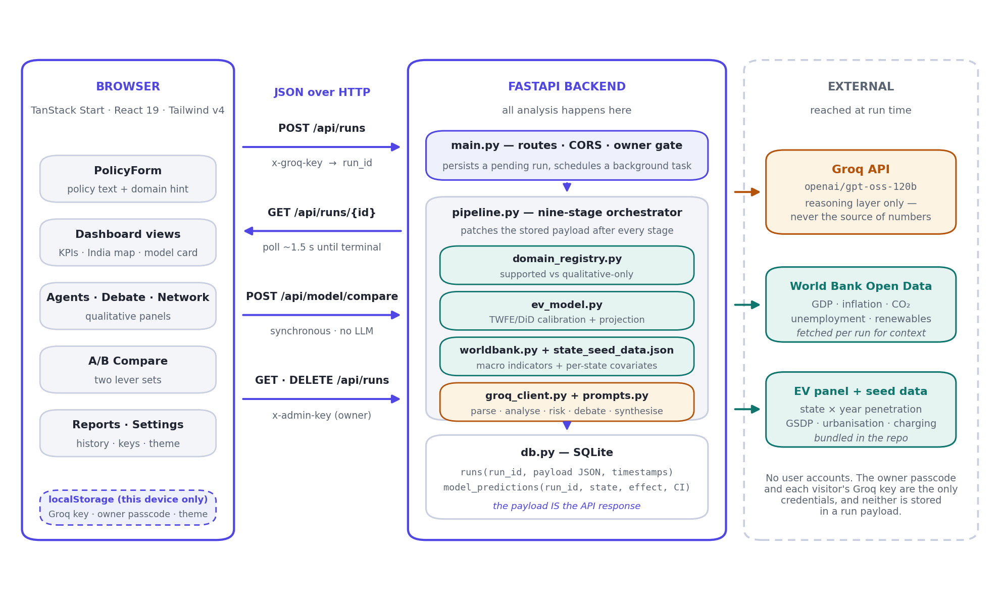
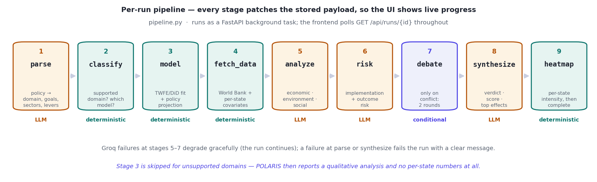
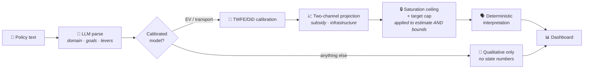

<div align="center">

# 🇮🇳 POLARIS

### AI Policy Impact Dashboard for India

**Submit an Indian public policy in plain English. Get a state-by-state impact projection with real confidence intervals, an audit trail for every number, and a plain-language reading of what it all means.**

[](https://www.python.org/)
[](https://fastapi.tiangolo.com/)
[](https://react.dev/)
[](https://www.typescriptlang.org/)
[](https://tailwindcss.com/)
[](https://groq.com/)
[](#-testing--verification)
[](#-testing--verification)

</div>

---

## The problem this is built around

Most "AI policy analysis" tools ask a language model how a policy will turn out and print the answer. That produces confident prose with no number behind it, no uncertainty, and no way to check the reasoning.

POLARIS inverts the arrangement. **A fitted panel regression produces the numbers. The language model is only allowed to explain them.** Every figure on the dashboard traces back to either a regression coefficient, a published anchor value, or an arithmetic step you can reproduce — and the plain-English interpretation panel is generated deterministically in Python, so the words on screen can never drift away from the chart beside them.

> 📸 **Screenshot slot** — save a dashboard capture as `docs/screenshots/dashboard.png`, then delete the two comment markers below to make it render.

<!--
<div align="center">
  
  <sub><i>Dashboard: KPI header → “What this means” reading → state choropleth → quantitative model card</i></sub>
</div>
-->

---

## ✨ What makes it different

| | |
|---|---|
| 📐 **Numbers come from a regression, not a prompt** | A staggered-adoption TWFE / Difference-in-Differences model is fitted live on a state × year panel (23 states, 2015–2024, 230 observations) in numpy + pandas. No pre-baked demo scores. |
| 🎚️ **The projection responds to policy *design*** | Purchase incentives act through each state's **price sensitivity**; charging build-out acts through its **infrastructure gap**. A subsidy-led and an infra-led policy of identical strength reshape *which* states gain most — not just how much. |
| 🗣️ **The prose can't contradict the chart** | `interpretation.py` turns the model output into plain English deterministically — thresholds, comparisons and caveats are all computed. Zero LLM involvement, so it is reproducible and cannot hallucinate. |
| ⚖️ **Bounded, coherent uncertainty** | Confidence intervals are mapped through the same saturation ceiling and policy-target cap as the point estimate, so `0 ≤ lower ≤ estimate ≤ upper` always holds and no bound can imply an impossible adoption level. |
| 🥊 **The debate room only opens on real conflict** | Two adversarial agents are instantiated *only* when the evidence genuinely disagrees — wide intervals, cross-dimension direction conflicts, aggressive extrapolation, or a high-risk / low-confidence rating. They argue about interpreting existing numbers; they cannot create new ones. |
| 🚫 **Honest about domain coverage** | Only EV / transport has a calibrated model. For every other domain POLARIS says so and returns a qualitative analysis with **no invented state-level numbers**. |

---

## 🏗️ Architecture

<div align="center">
  
</div>

A TanStack Start frontend talks JSON to a FastAPI backend over four endpoints. Runs execute as background tasks and every stage patches a single SQLite JSON payload — **that payload *is* the API response**, which is what makes live progress polling trivial. Groq is reached only for reasoning stages; World Bank Open Data supplies macro context.

### The per-run pipeline

<div align="center">
  
</div>

Note the split: **stages 2, 3, 4 and 9 are deterministic Python** — domain classification, the quantitative model, data retrieval and the heatmap. The LLM handles parsing, qualitative analysis, risk and synthesis. A Groq failure mid-run degrades the run instead of killing it; a run that hangs is retired by a watchdog rather than polled forever.



---

## 📐 The quantitative model, described honestly

This is the part most worth reading carefully, and the part most projects overstate. POLARIS's model has **two distinct stages that make very different kinds of claim**.

**Stage 1 — Calibration (an estimator-recovery check).** A cluster-robust TWFE regression with state and year fixed effects is fitted to a state × year EV-penetration panel. The panel itself is **reconstructed**, not observed: state shares are back-cast from published 2024 anchors (CEEW FY24, EVreporter, ICCT/ETAuto) along India's national EV-penetration trajectory, with a fixed **+0.35 pp per exposure-year** policy effect written into the data. The regression recovers **0.339 pp/yr** from it.

> [!IMPORTANT]
> That recovery is a check that the estimator works — it is **not** a measurement of what Indian state EV policies achieved. The binary treatment coefficient comes out at **+0.24 pp with a 95% interval of [−0.17, +0.66]**, which spans zero. Swapping the reconstructed panel for observed VAHAN state-year registrations is the single change that would turn these coefficients into measurements. Until then, read this stage as methodology, not evidence.

**Stage 2 — Policy-conditional projection (a transparent scenario).** The calibrated dose slope is projected forward for the *specific* policy submitted, through two independent channels:

$$\text{gain}_s = \underbrace{H_s\left(1 - e^{-\text{raw}_s / H_s}\right)}_{\text{logistic saturation}}, \qquad H_s = \text{EV\_CEILING} - \text{baseline}_s$$

where each state's raw response combines a **subsidy channel** scaled by its GSDP-based price sensitivity and an **infrastructure channel** scaled by its current charging gap, times the policy horizon. The same transform — and any adoption target you set — is applied to the interval bounds, not just the point estimate.

| Stage | Claim strength | Depends on your policy? | What it's for |
|---|---|---|---|
| Calibration (TWFE/DiD) | Estimator-recovery check | ❌ No | Demonstrating the identification strategy |
| Event study | Illustrative | ❌ No | Pre-trend inspection and effect dynamics |
| Projection | Transparent scenario | ✅ Yes | Per-state effects, map colours, headline |
| Sensitivity / A/B compare | Pure model re-evaluation | ✅ Yes | Which lever the outcome hinges on |
| Random-Forest backtest | Predictive baseline (not causal) | ❌ No | Accuracy comparison, if scikit-learn is installed |

---

## 🖥️ Feature tour

<table>
<tr>
<td width="50%" valign="top">

**🗺️ State choropleth**<br>
Model-derived per-state predictions. Hover for projected EV share, policy effect, 95% interval, and which channel drove it.

</td>
<td width="50%" valign="top">

**🗣️ “What this means” panel**<br>
A to-scale range bar against a zero line, a one-line verdict, and six plain-English readings — all computed, never generated.

</td>
</tr>
<tr>
<td width="50%" valign="top">

**🎚️ Understood-as card + editable levers**<br>
See how POLARIS parsed your policy before you trust the numbers. If the parse is wrong, edit the levers and re-run — `lever_overrides` replace the LLM's reading.

</td>
<td width="50%" valign="top">

**🥊 Debate room**<br>
Proponent vs Skeptic across two bounded rounds with a moderator ruling, instantiated only on genuine conflict. Says so plainly when nothing conflicts.

</td>
</tr>
<tr>
<td width="50%" valign="top">

**🌪️ Sensitivity tornado**<br>
One-at-a-time lever swings from low to high setting. The longest bar is what your outcome actually hinges on.

</td>
<td width="50%" valign="top">

**⚔️ A/B policy compare**<br>
Two lever sets through an LLM-free synchronous endpoint. Returns instantly, diffs headline and per-state effects.

</td>
</tr>
</table>

Also in the app: a **Winners & Losers** panel ranking states and income tiers, a **Reasoning Chain** laying out Policy → Mechanism → Outcome → Distribution with every clause tied to a real lever or computed number, an **Impact & Influence graph**, a live **Reasoning Trace** stepper, and a one-click **print-optimised one-page brief**.

> 📸 **Screenshot slots** — save captures as `docs/screenshots/model-card.png` and `docs/screenshots/debate-room.png`, then delete the comment markers below.

<!--
<div align="center">
  
  
</div>
-->

---

## 🚀 Quickstart

**Prerequisites:** Python 3.11+, Node.js 20+, and a free [Groq API key](https://console.groq.com/keys).

### 1 — Backend

```bash
cd backend
python -m venv .venv

# macOS / Linux
source .venv/bin/activate
# Windows PowerShell
.\.venv\Scripts\Activate.ps1

pip install -r requirements.txt
cp .env.example .env          # then add: GROQ_API_KEY=gsk_your_key_here
uvicorn main:app --reload --port 8000
```

Health check → <http://localhost:8000/api/health> · Interactive API docs → <http://localhost:8000/docs>

### 2 — Frontend

```bash
npm install
npm run dev                   # http://localhost:3000
```

The frontend targets `http://localhost:8000`; override with `VITE_API_BASE_URL`. Production: `npm run build && npm run preview`.

### 3 — Try the model without the LLM

```bash
python backend/ev_model.py
```

Prints the calibration (dose slope ≈ +0.34 pp/yr, R² ≈ 0.94, 23 states, 230 obs), then four contrasting policy projections, the sensitivity tornado and an A/B compare — no API key required.

Then, in the app, submit a strong EV policy (large subsidies + heavy charging build-out over 5+ years) followed by a weak one (no subsidy, 1–2 years). The headline effect, the map's colour intensity and the winning states all visibly change — and the aggressive one also opens the debate room, because it extrapolates beyond the calibration window.

---

## ⚙️ Configuration

All backend settings live in `backend/.env` (which takes precedence over shell variables). See `.env.example`.

| Variable | Default | Purpose |
|---|---|---|
| `GROQ_API_KEY` | — | Server-wide key. A visitor's own key, sent per-run as `x-groq-key`, overrides it for that run. |
| `GROQ_MODEL` | `openai/gpt-oss-120b` | Reasoning model. |
| `POLARIS_ADMIN_KEY` | *(blank)* | Owner passcode. Set it before deploying — it gates the Reports history and run deletion. |
| `POLARIS_REQUIRE_KEY_FOR_RUNS` | on when an admin key is set | Requires the owner key or the caller's own Groq key to start a run, so nobody can spend your quota anonymously. |
| `POLARIS_RUNS_PER_HOUR` | `20` | Per-IP sliding-window cap on new analyses (owner exempt). |
| `POLARIS_ALLOWED_ORIGINS` | any origin | Comma-separated CORS allowlist for the deployed frontend. |
| `POLARIS_RUN_TIMEOUT_SECONDS` | `300` | Wall-clock ceiling on a single analysis. |
| `POLARIS_STALE_RUN_SECONDS` | `330` | A run with no update for this long (e.g. the backend restarted mid-run) is retired by the watchdog. |

> [!WARNING]
> `backend/db.py` serialises its read-modify-write with a per-process lock, so run the backend with **`--workers 1`** until WAL + a real transaction are in place.

---

## 🔌 API

| Method | Endpoint | Auth | Description |
|---|---|---|---|
| `GET` | `/api/health` | — | Liveness plus whether a server key is configured. |
| `POST` | `/api/runs` | `x-groq-key` or `x-admin-key` | Queue an analysis. Accepts policy text, an optional domain hint and `lever_overrides`. Returns a `run_id` immediately. |
| `GET` | `/api/runs/{run_id}` | — | Full run payload. Poll this; it carries live stage progress. |
| `GET` | `/api/runs` | `x-admin-key` | Run history. |
| `DELETE` | `/api/runs/{run_id}` · `/api/runs` | `x-admin-key` | Delete one run, or all of them. |
| `POST` | `/api/model/compare` | — | **Synchronous, LLM-free.** Diffs two lever sets. No quota exposure. |
| `GET` | `/api/admin/check` | `x-admin-key` | Validates the owner passcode and reports the run-gating policy. |

Keys are compared with `secrets.compare_digest`, and a visitor's Groq key is **never** written into a stored run payload.

---

## 🧪 Testing & verification

```bash
cd backend
pip install -r requirements.txt -r requirements-dev.txt
pytest                          # 58 cases

cd .. && npx tsc --noEmit       # 0 errors, strict mode
```

The suite is written as **invariants rather than golden numbers**, so a legitimate re-calibration doesn't break it while a genuine regression does:

- `test_ev_model.py` — intervals that contain their own point estimate, projections that cannot breach the saturation ceiling or a stated target, a stronger policy always doing more than a weaker one, monotonicity in the horizon, bit-for-bit determinism, and no crash on junk input.
- `test_interpretation.py` — the classification thresholds and target wording of the plain-language layer.
- `test_json_util.py` — every normaliser bounding, coercing and surviving hostile LLM output without raising.
- `test_conflict.py` — the full `detect_conflict` truth table, plus a regression guard that the projection can never again produce a sign-ambiguous interval.

---

## 🧱 Tech stack

<div align="center">

**Backend** · FastAPI · Uvicorn · SQLite · numpy · pandas · httpx · scikit-learn *(optional)*<br>
**Frontend** · TanStack Start · React 19 · TypeScript *(strict)* · Tailwind v4 · shadcn/ui · Recharts · Vite<br>
**AI & data** · Groq `openai/gpt-oss-120b` · World Bank Open Data · CEEW / EVreporter / ICCT anchors

</div>

<details>
<summary><b>📁 Project structure</b></summary>

```
backend/
├─ main.py               FastAPI routes, CORS, owner gate, rate limiting, watchdog
├─ pipeline.py           Nine-stage orchestrator + conditional debate trigger
├─ ev_model.py           TWFE/DiD calibration + two-channel policy projection
├─ interpretation.py     Deterministic plain-language reading of the model output
├─ json_util.py          Defensive normalisers for every LLM response
├─ domain_registry.py    Which domains have a calibrated model
├─ groq_client.py        Groq calls: JSON mode, concurrency limit, 429 back-off
├─ worldbank.py          Macro indicator retrieval
├─ db.py                 SQLite persistence + stale-run sweeper
├─ state_seed_data.json  Per-state published anchors and covariates
└─ tests/                58 invariant-based test cases

src/
├─ routes/index.tsx      Dashboard shell, polling, run lifecycle
├─ components/polaris/   23 feature components (map, model card, debate, tornado…)
└─ lib/polaris-api.ts    Typed API client with structured error handling

docs/                    Architecture diagrams (+ generator script)
```

</details>

---

## ⚠️ Known limitations

Stated plainly, because a policy tool that hides its assumptions is worse than no tool at all. These are also surfaced inside the app itself, next to the numbers they qualify.

1. **The EV panel is reconstructed, not observed.** Shares are back-cast from published 2024 anchors along India's national trajectory with a known policy effect written in. The regression therefore recovers a parameter the panel builder inserted rather than measuring one. A live VAHAN state-year feed is the fix; no such public API currently exists.
2. **The event-study pre-trend test is vacuous** on this panel — no pre-trend was injected, so flat pre-periods are guaranteed by construction. It demonstrates the visualisation, not the absence of confounding.
3. **Standard TWFE is biased under staggered adoption** — already-treated states act as bad controls (Goodman-Bacon; de Chaisemartin & D'Haultfœuille). A corrected estimator (Callaway & Sant'Anna) is out of scope for this build.
4. **The per-policy figure is a projection, not an out-of-sample measurement.** The two channel-incidence functions are documented modelling assumptions, not separately estimated elasticities.
5. **One domain has a calibrated model.** Everything else is explicitly qualitative — by design, rather than quietly fabricated.
6. **Single-worker only** until SQLite writes are properly transactional.

---

## 🗺️ Roadmap

- [ ] Ingest observed VAHAN state-year registrations, turning stage 1 from a recovery check into a measurement
- [ ] Callaway & Sant'Anna estimator alongside TWFE, with both reported side by side
- [ ] A second calibrated domain (rooftop solar is the natural candidate — the registry already has a slot for it)
- [ ] WAL + transactional writes, unlocking multi-worker deployment
- [ ] Frontend component tests (Vitest) to match the backend suite

---

## 🙏 Data & credits

State EV-penetration anchors from **CEEW** (FY24 EV Sector Snapshot), **EVreporter**, and **ICCT / ETAuto**. Policy-adoption years from state notifications and **transportpolicy.net**. Per-state covariates: urbanisation from **Census 2011**, GSDP per capita from state economic surveys, public-charging index from **MoHI / BEE** operational-PCS reporting. Macro indicators live from **World Bank Open Data**. Inference via **Groq**.

All figures are documented approximations of published sources, assembled for methodological demonstration. **POLARIS is a research and portfolio project — it is not a substitute for official policy analysis, and its projections should not be used to make real policy decisions.**

<div align="center">
<br>
<sub>Built with an insistence that every number on screen can be traced back to where it came from.</sub>
</div>

